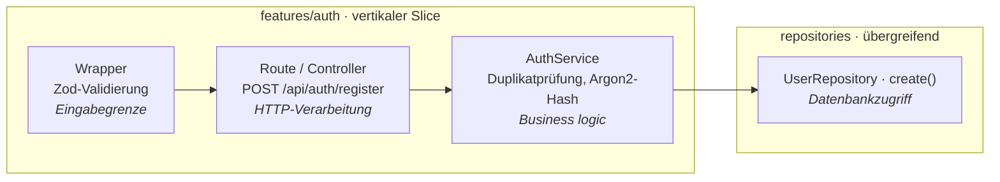

# Agora Auth


> [!NOTE]
> **MVP erreicht**
> Das Projekt hat seinen Minimum-Viable-Product-Meilenstein erreicht. Alle Kern-Authentifizierungsabläufe, das Admin-Dashboard, die CI/CD-Pipeline, das Produktions-Deployment und die Internationalisierung sind voll funktionsfähig.

> [!NOTE]
> Das Frontend ist derzeit nicht für kleinere Bildschirme optimiert und wird am besten auf dem Desktop betrachtet.

<p align="center">
  <picture>
    <source media="(prefers-color-scheme: dark)" srcset="src/assets/agora-logo-dark.svg" />
    
  </picture>
</p>

Ein Fullstack-Authentifizierungs- und Benutzerverwaltungssystem, entwickelt als Abschlussprojekt eines Webentwicklungs-Programms, mit Next.js, Drizzle ORM und PostgreSQL.

## Inhaltsverzeichnis

- [Agora Auth](#agora-auth)
    - [Inhaltsverzeichnis](#inhaltsverzeichnis)
    - [Über das Projekt](#über-das-projekt)
        - [Hauptfunktionen](#hauptfunktionen)
        - [Prioritäten](#prioritäten)
    - [Tech-Stack](#tech-stack)
    - [Voraussetzungen](#voraussetzungen)
    - [Erste Schritte](#erste-schritte)
    - [Konfiguration](#konfiguration)
    - [Deployment](#deployment)
        - [CI/CD-Pipeline](#cicd-pipeline)
        - [Infrastruktur](#infrastruktur)
        - [VPS-Layout](#vps-layout)
    - [Projektstruktur](#projektstruktur)
        - [Beispiel: Registrierungsablauf](#beispiel-registrierungsablauf)
    - [Entwicklungs-Workflow](#entwicklungs-workflow)
        - [Nützliche Befehle](#nützliche-befehle)
    - [Reflexion](#reflexion)
    - [Roadmap \& Dokumentation](#roadmap--dokumentation)
    - [Lizenz](#lizenz)

---

## Über das Projekt

Agora Auth ist das Abschlussprojekt eines Fullstack-Webentwicklungs-Programms und wurde innerhalb von ca. 13 Arbeitstagen, plus wenige zusätzliche Tage für die Vorbereitung, entwickelt.

Das Ziel war es, ein produktionsreifes Authentifizierungs- und Benutzerverwaltungssystem von Grund auf zu entwerfen und umzusetzen - von der Backend-Architektur über das Datenbankdesign und die API-Entwicklung bis hin zur Frontend-UI, CI/CD und dem Deployment auf einem Live-Server.

Das Projekt basiert auf Next.js Server Actions, Drizzle ORM und PostgreSQL, um ein sicheres und skalierbares Identitätsmanagementsystem bereitzustellen. Dabei haben bewährte Sicherheitspraktiken wie HTTP-only-Cookies, `Argon2`-Passwort-Hashing, RS256-signierte JWTs und durchgehend strenge `zod`-Eingabevalidierung höchste Priorität.

### Hauptfunktionen

- **Login & Registrierung:** Sichere Anmeldung mit `Argon2`-Passwort-Hashing und Duplikatprüfung.
- **Session-Management:** Datenbankgestützte Sitzungen mit automatischer Refresh-Token-Rotation und Wiederverwendungserkennung.
- **Zustandslose JWT-Zugriffstoken:** RS256-signierte, kurzlebige Tokens mit öffentlichem JWKS-Endpunkt zur dienstübergreifenden Verifizierung.
- **Externe Client-API:** Drittanbieter-Dienste können Benutzer authentifizieren und Tokens unabhängig verifizieren.
- **Admin-Dashboard:** Paginierte Benutzertabelle mit Filterung, Sortierung, Sperr-/Aktivierungs- und Löschaktionen.
- **CI/CD-Pipeline:** Dreistufige GitHub-Actions-Pipeline (Verify, Package, Deploy) auf einen Live-VPS.
- **Internationalisierung:** Vollständige Unterstützung für Englisch und Deutsch via `next-intl`.

### Prioritäten

- **Bewusstes Engineering:** Zuverlässigkeit vor Geschwindigkeit, KI als Assistent nicht als Autopilot.
- **Produktionsreife Qualität:** Saubere Fehlerbehandlung und Edge Cases, nicht nur der Happy Path.
- **Saubere Architektur:** Klare Trennung der Zuständigkeiten, wartbare Codebasis.
- **Automatisierung & Workflow:** Automatisierte Qualitätsprüfungen und Deployment von Beginn an.

---

## Tech-Stack

- **Framework:** Next.js (React)
- **Styling:** Tailwind CSS
- **Runtime & Tooling:** Bun
- **Datenbank:** PostgreSQL
- **ORM:** Drizzle ORM
- **Validierung:** `zod`
- **JWT & JWKS:** `jose`
- **Internationalisierung:** `next-intl`
- **ID-Generierung:** `nanoid`
- **Toast-Benachrichtigungen:** `sonner`
- **Reverse Proxy:** Caddy (Auto-TLS)
- **CI/CD:** GitHub Actions
- **Container Registry:** GitHub Container Registry (GHCR)
- **Containerisierung:** Docker & Docker Compose

---

## Voraussetzungen

- **Betriebssystem:** Linux, macOS oder Windows (via WSL) für die Entwicklung
- **Containerisierung:** Docker & Docker Compose
- **Runtime:** Bun

---

## Erste Schritte

Mindest-Setup für die lokale Entwicklung:

```bash
bun install
cp .env.local.example .env.local      # dann mit echten Werten befüllen (JWT-Schlüssel, SMTP, Admin-Zugangsdaten)
cp .env.tunnel.example .env.tunnel    # nur nötig für Produktions-DB-Zugriff über SSH-Tunnel
bun run docker:up
bun run dev
```

> [!NOTE]
> `bun run dev` startet bereits `docker:up`, bevor Next.js ausgeführt wird. Ein manueller `docker:up`-Schritt ist optional, wenn die lokalen Container bereits laufen.

---

## Konfiguration

Die Anwendung wird über Umgebungsvariablen und eine zentralisierte Konfigurationsdatei unter `src/config/index.ts` konfiguriert.

Für eine detaillierte Aufschlüsselung aller Umgebungsvariablen, Secrets und deployment-spezifischen Konfigurationen siehe bitte die Datei **[NOTES.md](NOTES.md)**.

Wichtige Umgebungsvariablen umfassen:

- `APP_ENV`, `APP_URL`
- Datenbank-Anmeldeinformationen (`DB_HOST`, `DB_PORT`, `POSTGRES_DB`, `APP_DB_USER`, `APP_DB_PASSWORD`)
- Authentifizierungsschlüssel (`JWT_PRIVATE_KEY`, `JWT_PUBLIC_KEY`)
- SMTP-Einstellungen für den E-Mail-Versand (`SMTP_HOST`, `SMTP_PORT`, `SMTP_USER`, `SMTP_PASSWORD`, `MAIL_FROM`)

---

## Deployment

> [!IMPORTANT]
> Diese Anwendung nutzt eine CI/CD-Pipeline, die auf eine spezifische VPS-Umgebung zugeschnitten ist. Ein eigenständiges Deployment würde Anpassungen am Docker-Setup, an den Konfigurationsdateien und an der Pipeline erfordern.

### CI/CD-Pipeline

Das Projekt nutzt eine dreistufige GitHub-Actions-Pipeline (`.github/workflows/deploy.yaml`):

| Phase       | Auslöser      | Beschreibung                                                                                                     |
| ----------- | ------------- | ---------------------------------------------------------------------------------------------------------------- |
| **Verify**  | Alle Branches | Lint, Typecheck, Format-Check, Security-Audit, Build                                                             |
| **Package** | Nur `main`    | Docker-Images bauen und zu GHCR pushen                                                                           |
| **Deploy**  | Nur `main`    | Artefakte per Rsync auf VPS übertragen, Secrets generieren, Dienste starten, Migrationen und Bootstrap ausführen |

### Infrastruktur

- **Caddy** läuft als unabhängiger Docker-Compose-Stack mit automatischem TLS
- **App** (2 Replikas) + **Postgres** laufen als Haupt-Stack und beziehen fertige Images von GHCR
- **Migrator** läuft als kurzlebiger Container nach dem Deployment, um Schema-Änderungen und Seed-Daten anzuwenden
- Secrets werden zum Deployment-Zeitpunkt auf dem VPS aus GitHub-Repository-Secrets generiert

### VPS-Layout

```text
/srv/webapps/agora-auth/
├── compose.yaml               # Basis-Dienst-Definitionen
├── compose.production.yaml    # Produktions-Overrides (env_file, Replikas, Netzwerke)
├── compose.caddy.yaml         # Unabhängiger Caddy-Reverse-Proxy-Stack
├── docker/
│   ├── caddy/Caddyfile
│   └── postgres/init-db.sh
├── .env                       # Gemeinsame, nicht-geheime Konfiguration
├── .env.production            # Produktionsspezifische Konfiguration
├── .env.secrets.production.*  # Generierte, dienstspezifische Secret-Dateien (CI/CD)
```

---

## Projektstruktur

Das Projekt folgt einer feature-getriebenen, modularen Struktur, die auf dem Next.js App Router aufbaut:

```bash
.
├── docker/                 # Infrastruktur und Docker-Konfiguration
│   ├── app/                # Dockerfile der Anwendung
│   ├── caddy/              # Caddy Reverse-Proxy-Konfiguration
│   ├── migrator/           # Skript zur Datenbankmigration
│   └── postgres/           # Skripte zur Datenbankinitialisierung
├── docs/                   # API-Dokumentation
├── drizzle/                # Ausgabe der Datenbankmigrationen
├── messages/               # Übersetzungsdateien (i18n)
├── public/                 # Statische Ressourcen (robots.txt, etc.)
└── src/                    # Quellcode der Anwendung
    ├── app/                # Next.js App Router (Layout, Seiten und API-Routen)
    ├── components/         # Gemeinsam genutzte UI-Komponenten (Layout, Formulare, Tabellen)
    ├── config/             # Zentralisierte Anwendungs- und Umgebungskonfiguration
    ├── db/                 # Datenbankverbindung, Schemas und Seeding-Skripte
    ├── features/           # Feature-gesteuerte Logik (Auth, User, Admin)
    │   └── [feature]/      # Jedes Feature enthält spezifische Grenzen (Contracts, Dokumentation, Services, UI)
    │       ├── actions/    # Next.js Server Actions
    │       ├── components/ # Feature-spezifische UI-Komponenten
    │       ├── hooks/      # Feature-spezifische React-Hooks
    │       ├── services/   # Geschäftslogik und externe Aufrufe
    │       ├── contracts.ts# Zod-Validierungsschemata und DTOs
    │       ├── index.ts    # Öffentliche Feature-Exports
    │       └── types.ts    # TypeScript-Definitionen
    ├── hooks/              # Gemeinsam genutzte React-Hooks
    ├── lib/                # Kernfunktionen, Validierung und Wrapper
    ├── providers/          # Globale React-Context-Provider
    ├── repositories/       # Datenzugriffsschicht (Repositories)
    ├── i18n.ts             # Internationalisierungs-Setup
    ├── proxy.ts            # Proxy-Konfiguration
    └── types.ts            # Globale TypeScript-Definitionen
```

### Beispiel: Registrierungsablauf

Wie eine Anfrage die Schichten der Architektur durchläuft - am Beispiel der Benutzerregistrierung. Route, Wrapper und Service befinden sich innerhalb des vertikalen `features/auth`-Slices, während die Repositories feature-übergreifend genutzt werden.



---

## Entwicklungs-Workflow

Alle Entwicklungsaufgaben werden über Bun-Skripte in der `package.json` gesteuert:

- Initialisierung der Datenbank und Ausführen von Drizzle-Migrationen.
- Entwicklung von Frontend/Backend mit dem Next.js-Entwicklungsserver und Turbopack.
- Formatierung und Typprüfung der Codebasis (via Prettier, ESLint und `bun typecheck`).
- Build, Verifizierung und Deployment der Anwendung.

### Nützliche Befehle

| **Befehl**            | **Beschreibung**                                                   |
| --------------------- | ------------------------------------------------------------------ |
| `bun run dev`         | Startet Docker-Dienste und führt danach `next dev --turbopack` aus |
| `bun run build`       | Baut die Anwendung für die Produktionsumgebung                     |
| `bun run db:generate` | Generiert Drizzle SQL-Migrationen basierend auf Schema-Änderungen  |
| `bun run db:migrate`  | Wendet ausstehende Datenbankmigrationen an                         |
| `bun run db:push`     | Sendet Schema-Änderungen direkt an die Datenbank                   |
| `bun run db:studio`   | Öffnet Drizzle Studio zur Inspektion der Datenbank                 |
| `bun run db:reset`    | Setzt die Datenbank zurück und führt Seed-Skripte aus              |
| `bun run typecheck`   | Führt die TypeScript-Typprüfung im gesamten Projekt aus            |
| `bun run verify`      | Führt Linting, Typecheck und Format-Checks aus                     |
| `bun run docker:up`   | Startet die benötigten Docker-Container                            |
| `bun run docker:stop` | Stoppt die Docker-Container                                        |

---

## Reflexion

- **Strukturierte Planung** (`NOTES.md`, `TODO.md`) - Projekt auf Kurs gehalten, hat es erst ermöglicht
- **Frühe CI/CD-Pipeline** - spart später Zeit, erzwingt Sicherheitschecks (`bun audit`)
- **Sicherheit selbst bauen** - hoher Lerneffekt, hoher Zeitaufwand; Produktions-Apps nutzen meist etablierte Libraries (bewusster Trade-off zwischen Verständnis und Pragmatismus)
- **KI-Balance** - Assistent, nicht Autopilot; Vibe Coding ist verführerisch, aber tückisch
- **Next.js-Reibungspunkte** - doppelte Requests, Cookie-Handling, Caching-Verhalten
- **13 Arbeitstage** - extrem enger Rahmen

---

## Roadmap & Dokumentation

Das Projekt hat seinen MVP-Meilenstein erreicht. Eine Weiterentwicklung über diesen Punkt hinaus ist nicht garantiert.

Die Roadmap, das Implementierungs-Backlog, Designentscheidungen, Architektur-Skizzen und Logikabläufe sind in der **[NOTES.md](NOTES.md)** dokumentiert.
Übergreifende Aufgaben werden in der **[TODO.md](TODO.md)** festgehalten.

Die API-Dokumentation ist im Verzeichnis `docs/` zu finden:

- [API-Dokumentation (EN)](docs/api.md)
- [API-Dokumentation (DE)](docs/api_de.md)

**Ideen für zukünftige Weiterentwicklung:**

- Sicherheit
    - Rate Limiting
    - MFA
    - Bot-Schutz
- Mobile-Support
    - Tabelle
- Nutzer-Verwaltung
    - Profile
    - Einstellungen
    - Nutzerübersicht
- Admin-Funktionalität erweitern
    - Tabelle filtern
    - Nutzer anlegen, bearbeiten

---

## Lizenz

Dieses Projekt ist unter der MIT-Lizenz lizenziert. Weitere Details sind in der [LICENSE](LICENSE)-Datei zu finden.
